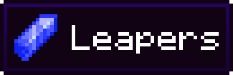

 

 

<h2>
<b>A simple transportation mod designed to let the player travel via light </b>
</h2>
 

 

## Inspiration

---
This mod was originally inspired by the pathfinder concept as seen in the book series "keeper of the Lost Cities". From there, it has been adapted to be more balanced for Minecraft gameplay.

## Goal

---
The goal of Leapers is to provide a more balanced transportation mod alternative to the way-stone mods.

## FAQ

---
### How do I download the mod?

- To download an official release of the mod, please head over to the Modrinth page link ~~here~~. *(no official releases are available)*
- To download a commit build, or pre-release, go to the repository packages.

### Will this mod be available for forge?

No. As shown in the tags above, this mod will never be official supported for forge.

### Will this mod be back-ported to previous version?

No. This mod will only support the newest version of Minecraft. However, old stable versions of the mod will be archived that do support older version of Minecraft.

## License 

---
This project is under the MIT license
